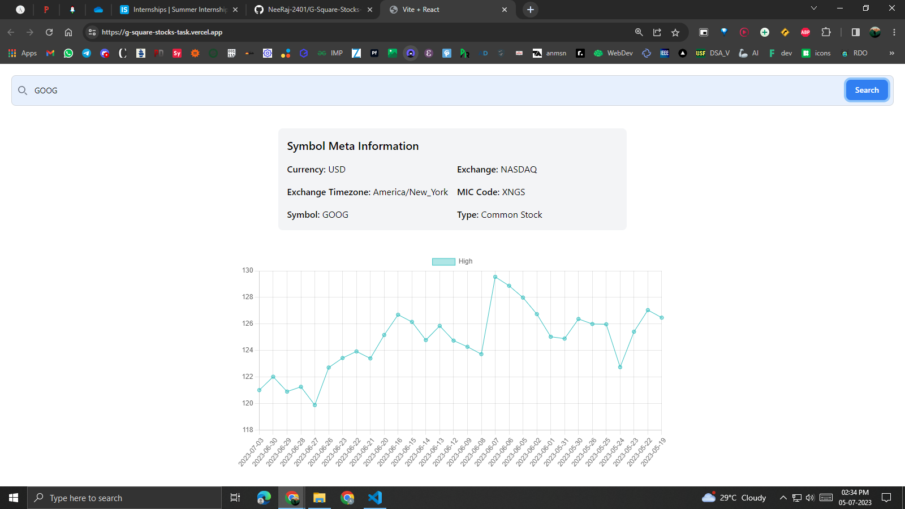

# Stock Price History

Stock Price Tracker is a simple web application that allows users to view the stock prices of a particular company for the last 30 days. By entering the symbol name of a company, users can retrieve and visualize the stock price data in a line chart.

## Features

- **Search:** Enter the symbol name of a company to search for its stock price data.
- **Graph:** View the stock price data of the company in a line chart for the last 30 days.
- **Meta Information:** Display additional meta information about the company, including currency, exchange, exchange timezone, MIC code, symbol, and type.

## Screenshots

  

## Technologies Used

- React: JavaScript library for building user interfaces.
- Chart.js: JavaScript library for creating charts and graphs.
- Fetch API: JavaScript interface for making HTTP requests.
- Tailwind CSS: Utility-first CSS framework for styling the application.

## Getting Started

To run the Stock Price Tracker app locally, follow these steps:

1. Clone the repository: `git clone <repository-url>`
2. Navigate to the project directory: `cd G-Square-Stocks-Task`
3. Install the dependencies: `npm i --force`
4. Start the development server: `npm run host`

## Usage

1. Enter the symbol name of a company in the search bar such as `GOOG, MSFT` etc.
2. Click the "Search" button or press Enter.
3. The stock price data for the company will be displayed in a line chart.
4. Additional meta information about the company will be shown below the search bar.
5. To search for another company, repeat steps 1-4.

